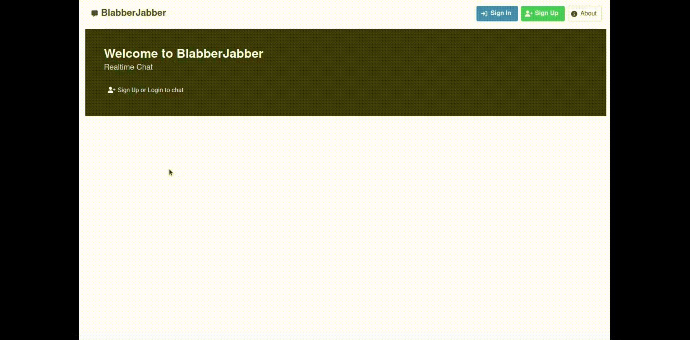

# blabber-jabber
A sample Realtime Chat application




### What is implemented
- [x] User join or create a chat room by entering a name.
- [x] User see the list of users in the chat room
- [x] User can read the last 10 messages.
- [x] Users can read new messages.
- [x] User can write and send new messages.

**NB**: `users only see messages in the chat rooms they joined`

### Other features

- [x] User can signup.
- [x] User can login.
- [ ] A hosted version of your app
- [ ] Admin of a chat room (first user) can kick other users

### Extra features
- [x] See user status (online, offline)
- [x] See who is typing in a chat room.
- [x] Get notifications when a message is posted on a specific chat room
- [x] Users can leave a chat room

---
# How to run 

A version of the project is deployed under https://blabber.playground.codeplumbers.eu, but it is a WIP. I've had issues with deploying the websocket service behind a reverse proxy (nginx) and traefik :/. I didn't have the time to fix this.

To run the app locally, there are two .env files that need to be created:
- <root>**/.env** (see .env.sample)
  ```
    SECRET_KEY=django-fake*-secret-key
    DEBUG=True

    # Database connection
    DB_HOST=blabber-db
    DB_NAME=blabber-app
    DB_USER=postgres
    DB_PASS=postgres
    POSTGRES_VERSION=latest
    DJANGO_DOCKER_PORT=8080
    POSTGRES_DOCKER_PORT=5432
    FRONTEND_DOCKER_PORT=80
    PGADMIN_MAIL=admin@dev.dev
    PGADMIN_PW=admin
    PGADMIN_PORT=5050
    REDIS_HOST=blabber-cache
    REDIS_PORT=6379
    REDIS_PASSWORD=changeme
    CACHE_TTL=30
  ``` 
- <root>**frontend/.env** (see frontend/.env.sample)
  ```
   VUE_APP_API_BASE_URL='http://localhost:8080/api/v1/'
   VUE_APP_WEBSOCKET_URL='ws://localhost:8008/ws'
  ```
Once that is done, you can run the development environment locally, from the main branch, using:

```
docker-compose -f docker-compose-dev.yml up -d
```

or (branch: deploy, WIP):

```
docker-compose -f docker-compose-prod.yml up -d
```
---
# Architecture
## Docker
The project is built using docker and docker compose. it has the following services: 
* **blabber-app**: a django application that exposes a REST Api and handles websocket connections
* **blabber-frontend**: the UI built with vue js
* **blabber-db**: a PostgreSQL server
* **blabber-pgadmin**: a pgadmin instance (dev)
* **blabber-portainer**: portainer dashboard to manage docker containers
* **blabber-cache**: a redis server
* **blabber-cache-ui**: a redis ui helper (dev)

See `docker-compose-dev.yml`, `docker-compose-prod.yml` (along with `deploy` branch)

## Frontend:
The UI is built using 
* Vue3
* Typescript
* [Bulma](https://bulma.io) css
* Vue Router
* Vuex (with vuex-helper-decorators)

In order to easily prototype vue components, I've user Storybook. You can launch it with: 
```yarn storybook```

## Backend
Used: 
* Django
* Djang Rest Framework
* Redis
* Django channels for the realtime chat (websockets)
* PostgreSQL

I've added a management command in order to seed the db, to run it: 

`
docker exec -it blabber-it python manage.py db_seed --users 3 
`

The `users` argument is the number of users that will be created. e.g. --users 3 will create: 

```
User 1: username=user1, password=password
User 2: username=user2, password=password
User 3: username=user3, password=password
```

## Database
The relevant tables in the database are linked to the following models:
- **ChatRoom**: represents a room. Each room has a list of users. A user can be a member of different chat rooms
- **Message**: a message sent to a specific chat room by a specific user
- **User**: based on the standard User model of django
- **UserProfile**: enriches the information about a User (One to One relation with a User)
  
for more information see : `backend/chat/models.py`

## Websocket and realtime communication
The app is based on WebSockets in order to handle realtime message transfers between clients (frontends). For the time being, the websocket connection is not authenticated (`todo: add auth middleware`)

There implementation is based on Django Channels using a Redis Backend.

There are two `consumers` (see [documentation](https://channels.readthedocs.io/en/stable/introduction.html)):
- **ChatEventConsumer**: listens to the lobby (the main channel which handles room notifications, users statuses, etc).
  - URL: `/ws/lobby/`
- **ChatConsumer**: listens to a specific chat room (new messages and user typing events)
  - URL: `/ws/room/:room_name`

For more information, see:
- `backend/chat/consumers.py`
- `backend/chat/routing.py`
- `backend/core/asgi.py` (Protocol based routing)

## Events
Based on django signals, which allow to listen for specific events across the applications, I used events on the **ChatRoom**, **Message** and **User** models to dispatch information through the WebSocket connection.

- **ChatRoom**: 
  - When a user is added to a Chat Room (User added to ChatRoom.users), send `chat_room_update` message (without payload) to the lobby in order to refresh info about rooms on the client
  - When a user is removed from a Chat Room, same as previous
- **Message**:
  - When a Message is saved, dispatch `chat_room_update` (with payload, message information) to refresh related chat room on the client side (notify user, display the new message)
- **User**:
  - When a User logs in to the application, dispatch `user_status_update` with user_id and online = true status
  - When a User logs out, dispatch `user_status_update` with user_id and online = false status.
  
For more information: `backend/chat/signals.py` and `backend/users/signals.py`

## REST API

### Listing Chat Rooms

### Authentication

# Limitations and todos
The current code has certain limitations:
- User profile management is still a WIP (branch: `BLAB-010-user-profile`)
- Simplify and refactor websocket client instances to decouple from vue Views.
- Handle token refreshes and disconnect on auth errors
- Integration test the API
- UI tests (selenium), JEST
  
## Ideas 
- add message search (using PostgreSQL fulltext search or elastic search)
- upload attachements with messages
- add a moderation microservice to filter messages

